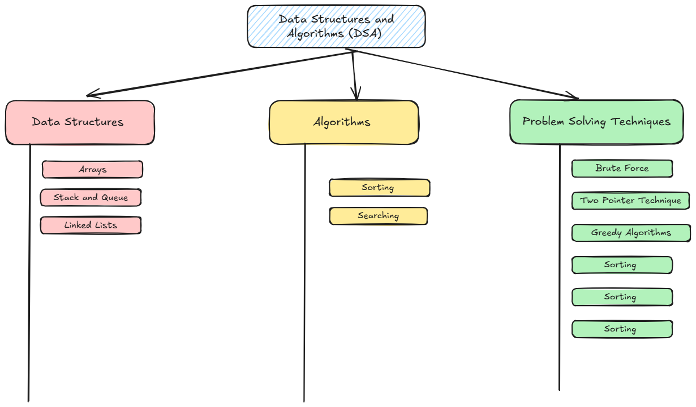

# 1. Introduction

The best way to learn is not to read books or listen to lectures. It's to actively practice and solve problems.

## What the different Data structure and Algorithems

Data structures organize and store data (Array, Linked list, Hashmap ..etc), while algorithms provide the steps to manipulate that data (binary Search)

## Programming language

You may use any programming language however, this repository primarily utilizes C# and Go.

## Algorithems Analysis

## Leedcode

Each chapter includes a dedicated LeetCode section that links to carefully selected problems designed to reinforce and apply the concepts discussed. For a hands‑on warm‑up and to familiarize yourself with the platform, begin with Problem 1 in the “More Problems” section at the end of the page.

## Mind Map

# Leetcode Problems

## Blind 75

## More Problems

1. [371. Sum of Two Integers](https://leetcode.com/problems/sum-of-two-integers/description/)
