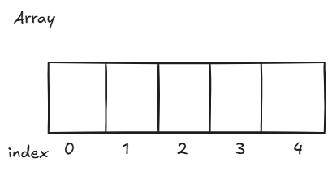

# 2. Arrays

Array is one of the most used data structures. An array is a collection of items stored at continuous memory locations.
Arrays store multiple items of the same type together in memory. They use indexes starting from 0 to access individual elements.

| Operation            | Big(O) Time |
| -------------------- | ----------- |
| Acess i-th element   | O(1)        |
| Insert/Remove end    | O(1)        |
| Insert/Remove middle | O(1)        |

