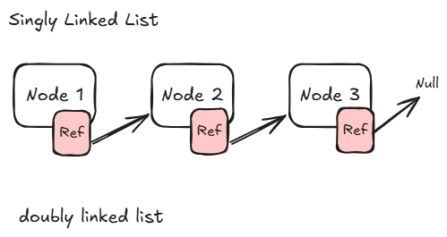

# 4. Linked List

Linked list

| Operation            | Big(O) Time                                  |
| -------------------- | -------------------------------------------- |
| Acess i-th element   | O(n)                                         |
| Insert/Remove end    | O(1)                                         |
| Insert/Remove middle | O(1) - No Shift but you need to search first |

## C# Implmentation

in this section we

# Leetcode Problems

## Blind 75

1. [206. Reverse Linked List](https://leetcode.com/problems/reverse-linked-list/description/)

## More Problems
